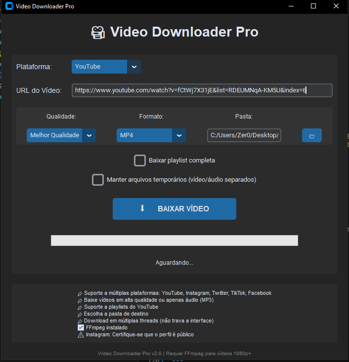

# ZDown


Um downloader de vídeos com interface gráfica, suportando YouTube, Instagram, Twitter, TikTok e Facebook.

## Screenshot



## Funcionalidades

- 🎨 Interface gráfica moderna (modo escuro)
- 📹 Download de vídeos em múltiplas qualidades (1080p, 720p, 480p, 360p)
- 🎵 Extração de áudio para MP3
- 📋 Suporte a playlists do YouTube
- 📱 Download de vídeos do Instagram, Twitter, TikTok e Facebook
- 📁 Escolha da pasta de destino
- 📊 Barra de progresso em tempo real
- 🖥️ Geração de executável para Windows

## Pré-requisitos

- Python 3.7+
- FFmpeg (para vídeos 1080p+ e extração de áudio)

### Instalando FFmpeg

**Windows:**
```bash
1. Baixe em: https://www.gyan.dev/ffmpeg/builds/
2. Arquivo: ffmpeg-release-full.7z
3. Extraia para C:\ffmpeg
4. Adicione C:\ffmpeg\bin ao PATH do sistema
```

**Linux/WSL:**
```bash
sudo apt update && sudo apt install ffmpeg -y
```

## Instalação

```bash
# Clone o repositório
git clone https://github.com/Zer0G0ld/ZDown.git
cd ZDown

# Crie um ambiente virtual (opcional)
python -m venv venv

# Ative o ambiente virtual
source venv/bin/activate  # Linux/WSL
venv\Scripts\activate     # Windows

# Instale as dependências
pip install -r requirements.txt

# Execute
python main.py
```

Ou use o instalador automático:

```bash
python install_deps.py
```

## Como usar

1. Selecione a plataforma (YouTube, Instagram, etc.)
2. Cole a URL do vídeo
3. Escolha a qualidade desejada
4. Selecione o formato (MP4 ou MP3)
5. Escolha a pasta de destino
6. Clique em **BAIXAR VÍDEO**

## Criar executável (Windows)

```bash
python setup.py              # Versão única (.exe)
python setup.py --portable   # Versão portátil (pasta)
python setup.py --clean      # Limpar arquivos temporários
```

O executável será gerado na pasta `dist/`

## Estrutura do projeto

```
ZDown/
├── main.py           # Programa principal
├── setup.py          # Gerar executável
├── install_deps.py   # Instalar dependências
├── create_icon.py    # Criar ícone
├── requirements.txt  # Dependências
├── icon.ico         # Ícone do app
├── LICENSE          # Licença GPLv3
├── screenshots/     # Imagens do programa
│   └── ZDown_v2.0.0.PNG
└── README.md        # Documentação
```

## Observações

| Plataforma | Observação |
|------------|------------|
| **YouTube** | Vídeos 1080p+ precisam de FFmpeg |
| **Instagram** | Funciona apenas com perfis públicos |
| **Playlists** | Suportado apenas no YouTube |
| **Windows** | O executável pode ser detectado como vírus (falso positivo) |

## Evolução do projeto

| Versão | Ano | Funcionalidades |
|--------|-----|-----------------|
| **v1.0** | 2024 | CLI, apenas áudio, só YouTube |
| **v2.0** | 2025 | GUI completa, vídeo+áudio, 5 plataformas, playlists |

## Tecnologias utilizadas

| Tecnologia | Finalidade |
|------------|------------|
| Python + customtkinter | Interface gráfica moderna |
| pytubefix | Download do YouTube |
| yt-dlp | Download de outras plataformas |
| FFmpeg | Processamento de vídeo/áudio |
| PyInstaller | Geração do executável |

## Licença

Este projeto está sob a licença **GPLv3**. Veja o arquivo [LICENSE](LICENSE) para mais detalhes.

---

Desenvolvido por [Zer0](https://github.com/Zer0G0ld)